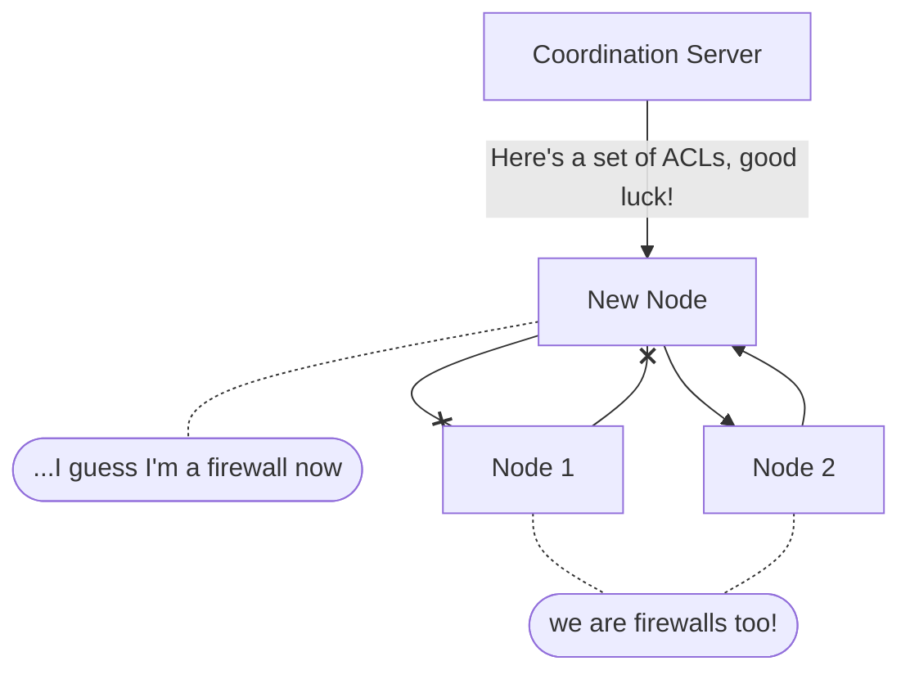

```mermaid
graph TB
    nc["New Node"]
    nctb(["...I guess I'm a firewall now"])
    nc -.- nctb
    crdn["Coordination Server"]

    crdn -- "Here's a set of ACLs, good luck!" --> nc

    c1["Node 1"]
    c2["Node 2"]
    ctb(["we are firewalls too!"])

    nc --x c1 --x nc
    nc --> c2 --> nc

    c1 & c2 -.- ctb
```