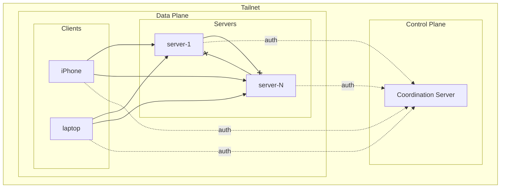

```mermaid
graph
    subgraph Tailnet
    subgraph Data Plane
        subgraph Clients
            iPhone
            laptop
        end
        subgraph Servers
            server-1
            server-N
        end
        iPhone --> server-1 & server-N
        laptop --> server-1 & server-N
        server-1 --x server-N
        server-N --x server-1
        
    end
    subgraph Control Plane
        crdn["Coordination Server"]
    end

    iPhone & laptop & server-1 & server-N -. auth .-> crdn
end
```